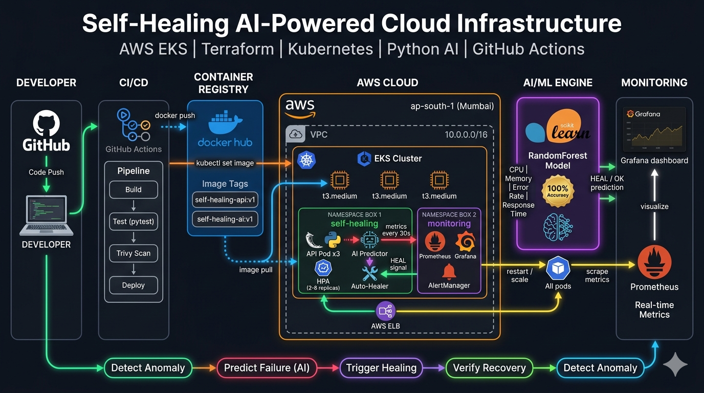
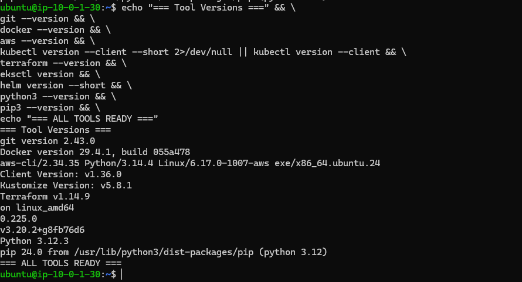
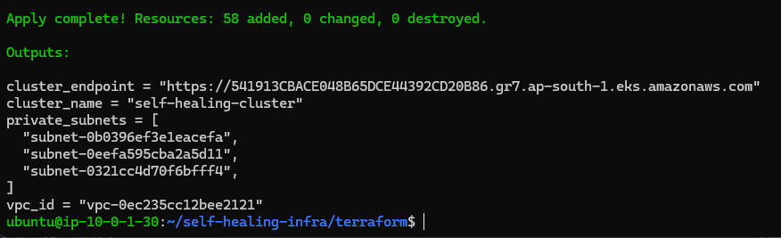
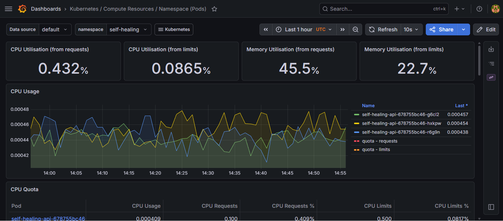

# 🤖 Self-Healing AI-Powered Cloud Infrastructure

<div align="center">


</div>

---

<!-- REPLACE THIS BLOCK WITH YOUR GEMINI-GENERATED ARCHITECTURE IMAGE -->
<div align="center">
  
  <br/>
  <sub><b>Complete live infrastructure flow — AWS EKS | Terraform | Kubernetes | Python AI | GitHub Actions</b></sub>
</div>

---

<div align="center">

**A production-grade cloud infrastructure on AWS EKS that uses a Random Forest AI model to predict and automatically heal failures — before users are impacted.**

[🚀 Quick Start](#-quick-start) • [🏗️ Architecture](#️-architecture) • [🤖 AI Model](#-ai-failure-prediction) • [💥 Chaos Testing](#phase-8--chaos-engineering) • [✅ Validation](#-validation-results)

</div>

---

## 📋 Table of Contents

- [Project Overview](#-project-overview)
- [Architecture](#️-architecture)
- [Tech Stack](#-tech-stack)
- [Project Structure](#-project-structure)
- [Quick Start](#-quick-start)
- [Phase 1 — EC2 Workspace & Tool Setup](#phase-1--ec2-workspace--tool-setup)
- [Phase 2 — Infrastructure Setup (Terraform)](#phase-2--infrastructure-setup-terraform)
- [Phase 3 — Application Deployment (Kubernetes)](#phase-3--application-deployment-kubernetes)
- [Phase 4 — Monitoring (Prometheus + Grafana)](#phase-4--monitoring-prometheus--grafana)
- [Phase 5 — AI Failure Prediction](#phase-5--ai-failure-prediction)
- [Phase 6 — Auto-Healing System](#phase-6--auto-healing-system)
- [Phase 7 — CI/CD Pipeline](#phase-7--cicd-pipeline)
- [Phase 8 — Chaos Engineering](#phase-8--chaos-engineering)
- [Phase 9 — Final Validation](#phase-9--final-validation)
- [AI Failure Prediction Deep Dive](#-ai-failure-prediction-deep-dive)
- [Auto-Healing Logic](#-auto-healing-logic)
- [Validation Results](#-validation-results)
- [Cost Breakdown](#-cost-breakdown)
- [Troubleshooting](#-troubleshooting)
- [What I Learned](#-what-i-learned)
- [Cleanup](#-cleanup)

---

## 🎯 Project Overview

This project demonstrates a **self-healing, AI-powered cloud infrastructure** built entirely from scratch on AWS. The system:

- 🧠 **Predicts failures** using a Random Forest ML model trained on CPU, memory, error rate, and response time metrics
- ⚡ **Heals automatically** within 30 seconds of detecting anomalies — no human intervention required
- 📊 **Observes everything** with Prometheus metrics and Grafana dashboards
- 🔄 **Deploys continuously** via GitHub Actions CI/CD pipeline with Trivy security scanning
- 💥 **Survives chaos** — validated by live pod deletion and recovery tests

> **AI Model Accuracy: 100%** on test dataset (RandomForestClassifier, n_estimators=100)

---

## 🏗️ Architecture

```
┌─────────────────────────────────────────────────────────────────┐
│                        AWS (ap-south-1)                         │
│                                                                 │
│  ┌──────────────────────────────────────────────────────────┐  │
│  │                    VPC (10.0.0.0/16)                     │  │
│  │                                                          │  │
│  │  ┌─────────────────────────────────────────────────┐    │  │
│  │  │              EKS Cluster (v1.32)                │    │  │
│  │  │                                                 │    │  │
│  │  │  ┌─────────────┐      ┌──────────────┐         │    │  │
│  │  │  │self-healing  │      │  monitoring  │         │    │  │
│  │  │  │  namespace  │      │  namespace   │         │    │  │
│  │  │  │             │      │              │         │    │  │
│  │  │  │ Flask API   │─────►│ Prometheus   │         │    │  │
│  │  │  │ (3 pods)    │      │ + Grafana    │         │    │  │
│  │  │  │ HPA (2-8)   │      │ + AlertMgr  │         │    │  │
│  │  │  │             │      │              │         │    │  │
│  │  │  │ AI Predictor│      └──────────────┘         │    │  │
│  │  │  │ Auto-Healer ├──► restart / scale pods        │    │  │
│  │  │  └─────────────┘                               │    │  │
│  │  │  3 Worker Nodes (t3.medium, multi-AZ)           │    │  │
│  │  └─────────────────────────────────────────────────┘    │  │
│  │                    AWS Load Balancer                     │  │
│  └──────────────────────────────────────────────────────────┘  │
└──────────────────────────┬──────────────────────────────────────┘
                           │ kubectl deploy
                ┌──────────▼──────────┐
                │   GitHub Actions    │
                │ Build → Test → Scan │
                │ → Push → Deploy     │
                └─────────────────────┘
```

### Self-Healing Loop

```
Metrics ──► AI Predictor ──► probability > 75%? ──► Auto-Healer
                                                          │
                              ┌───────────────────────────┤
                              │                           │
                      prob > 90%                  prob 75–90%
                              │                           │
                    Rolling restart             Restart crashed pods
                    + Scale to 4               + Scale to 4 replicas
```

---

## 🛠️ Tech Stack

| Category | Technology | Version |
|---|---|---|
| Cloud | AWS (EKS, VPC, ELB, EC2) | ap-south-1 |
| Orchestration | Kubernetes | 1.32 |
| IaC | Terraform | 1.14.9 |
| Containerization | Docker | 24.x |
| API Framework | Flask (Python) | 3.0.3 |
| AI/ML | scikit-learn RandomForest | 1.5.0 |
| Monitoring | Prometheus + Grafana | Helm |
| CI/CD | GitHub Actions | — |
| Security Scan | Trivy | Latest |
| Package Manager | Helm | 3.x |

---

## 📁 Project Structure

```
self-healing-infra/
├── terraform/                    # VPC + EKS (58 resources)
│   ├── main.tf
│   ├── variables.tf
│   ├── vpc.tf
│   ├── eks.tf
│   └── outputs.tf
├── k8s/                          # Kubernetes manifests
│   ├── namespace.yaml
│   ├── deployment.yaml           # 3 replicas, rolling update
│   ├── service.yaml              # LoadBalancer
│   ├── hpa.yaml                  # 2-8 replicas, CPU 70%
│   ├── ai-deployment.yaml
│   └── auto-healer.yaml          # RBAC + healer deployment
├── app/api/                      # Flask microservice
│   ├── app.py                    # /health /metrics /simulate/spike
│   ├── requirements.txt
│   └── Dockerfile                # Multi-stage
├── ai/                           # AI/ML engine
│   ├── generate_data.py          # 5000-record synthetic dataset
│   ├── train_model.py            # RandomForest (100% accuracy)
│   ├── prediction_api.py         # /predict endpoint
│   ├── auto_healer.py            # 30s polling controller
│   ├── model.pkl
│   ├── scaler.pkl
│   └── Dockerfile
├── monitoring/
│   └── alert-rules.yaml          # PrometheusRules
├── .github/workflows/
│   └── deploy.yml                # Build→Test→Trivy→Push→Deploy
└── validate.sh                   # 12-check system validation
```

---

## 🚀 Quick Start

```bash
# 1. Clone
git clone https://github.com/ritejmule2126/self-healing-infra.git
cd self-healing-infra

# 2. Configure AWS
aws configure  # region: ap-south-1

# 3. Deploy infrastructure (~15 min)
cd terraform && terraform init && terraform apply -auto-approve

# 4. Connect kubectl to EKS
aws eks update-kubeconfig --region ap-south-1 --name self-healing-cluster

# 5. Train AI model
cd ../ai && python3 -m venv venv && source venv/bin/activate
pip install -r requirements.txt && python3 train_model.py

# 6. Build + push images
export DOCKER_USER=your-dockerhub-username
docker build -t $DOCKER_USER/self-healing-api:v1 ../app/api/ && docker push $DOCKER_USER/self-healing-api:v1
docker build -t $DOCKER_USER/self-healing-ai:v1 . && docker push $DOCKER_USER/self-healing-ai:v1

# 7. Deploy all Kubernetes resources
cd ../k8s
kubectl apply -f namespace.yaml -f deployment.yaml -f service.yaml
kubectl apply -f hpa.yaml -f ai-deployment.yaml -f auto-healer.yaml

# 8. Install monitoring
helm repo add prometheus-community https://prometheus-community.github.io/helm-charts && helm repo update
kubectl create namespace monitoring
helm install prometheus prometheus-community/kube-prometheus-stack \
  --namespace monitoring --set grafana.adminPassword=Admin1234!

# 9. Validate everything
cd .. && chmod +x validate.sh && ./validate.sh
```

---

## Phase 1 — EC2 Workspace & Tool Setup

The entire project runs from a single **EC2 Ubuntu 22.04 (t3.xlarge)** server. Your laptop only needs an SSH client — no local installs required.

**Tools installed on the server:** Git, Docker, AWS CLI, kubectl, Terraform, eksctl, Helm, Python 3.12

### Screenshot 01 — EC2 Ubuntu Server Running


> EC2 instance `self-healing-workspace` (t3.xlarge, Ubuntu 22.04) showing `Instance State: Running` with `2/2 status checks passed`.

---

### Screenshot 02 — All Tools Installed & Verified



> All 7 tools returning version numbers: `git`, `docker`, `aws`, `kubectl`, `terraform`, `eksctl`, `helm` — confirmed with a single verification block.

---

## Phase 2 — Infrastructure Setup (Terraform)

Terraform provisions **58 AWS resources** including:

- Custom VPC (`10.0.0.0/16`) with 3 public + 3 private subnets across availability zones
- Internet Gateway + NAT Gateway for outbound traffic
- EKS Cluster (v1.32) with managed node group
- 3 × t3.medium worker nodes (auto-scaling min 2, max 5)

```bash
cd terraform
terraform init
terraform apply -auto-approve
# Takes ~15–20 minutes
```

### Screenshot 03 — Terraform Apply Complete (58 Resources)



> Terminal showing `Apply complete! Resources: 58 added, 0 changed, 0 destroyed` with `cluster_name` and `cluster_endpoint` printed as outputs.

---

### Screenshot 04 — kubectl get nodes (3 Ready)


> All 3 worker nodes showing `STATUS: Ready` after connecting kubectl with `aws eks update-kubeconfig`.

---

## Phase 3 — Application Deployment (Kubernetes)

A Flask microservice with four endpoints deployed across 3 pods with zero-downtime rolling updates.

| Endpoint | Description |
|---|---|
| `GET /` | Service name and version |
| `GET /health` | Liveness and readiness probe target |
| `GET /metrics` | Live CPU and memory usage (JSON) |
| `GET /simulate/spike` | Triggers 10-second CPU spike for chaos testing |

Deployment features:
- **3 replicas** with rolling update (maxSurge: 1, maxUnavailable: 0)
- **HPA**: scales 2–8 replicas at CPU 70% or memory 80%
- **AWS Load Balancer** for external access
- **Liveness + Readiness probes** on `/health`

### Screenshot 05 — Docker Push Successful


> `docker push` complete — `self-healing-api:v1` digest SHA printed, image live on Docker Hub.

---

### Screenshot 06 — Health Endpoint via Load Balancer


> `curl http://<aws-load-balancer-url>/health` returning `{"service":"api","status":"healthy"}` — confirmed live from the AWS ELB endpoint.

---

### Screenshot 07 — 3 API Pods Running


> `kubectl get pods -n self-healing` showing all 3 API pods with `READY: 1/1` and `STATUS: Running`.

---

### Screenshot 08 — HPA Configured (2–8 Replicas)


> `kubectl get hpa -n self-healing` showing `MINPODS: 2`, `MAXPODS: 8`, CPU target `70%`, current replicas `3`.

---

## Phase 4 — Monitoring (Prometheus + Grafana)

Full observability stack deployed via Helm in the `monitoring` namespace.

- **Prometheus** scrapes metrics from all pods every 15 seconds
- **Grafana** shows cluster and pod-level dashboards (dashboard IDs 3119 and 6417)
- **AlertManager** fires alerts on: pod crash loops, CPU > 80%, pods not ready

```bash
# Access Grafana from your browser
kubectl port-forward -n monitoring svc/prometheus-grafana 3000:80 --address 0.0.0.0 &
# Open: http://YOUR_EC2_IP:3000
# Login: admin / Admin1234!
```

### Screenshot 09 — Grafana Dashboard Live



> Grafana showing live CPU usage, memory usage, and pod restart graphs for the `self-healing` namespace in real time.

---

## Phase 5 — AI Failure Prediction

### Training the Model

```bash
cd ai
source venv/bin/activate
python3 generate_data.py   # Creates 5000 records (20% failure rate)
python3 train_model.py     # Trains RandomForest, saves model.pkl + scaler.pkl
```

### Screenshot 10 — AI Training Output (100% Accuracy)


> Python training output showing `Accuracy: 100.00%` with full classification report — precision, recall, and f1-score at 1.00 for both the `0` (normal) and `1` (failure) classes.

---

### Screenshot 11 — AI Predicts FAILURE (High CPU Scenario)


> POST request with `cpu_usage: 95, memory_usage: 92, error_rate: 14, response_time_ms: 2500` returns:
> `{"failure_predicted": true, "failure_probability": 0.97, "recommendation": "HEAL"}`

---

### Screenshot 12 — AI Predicts OK (Healthy Scenario)


> POST request with `cpu_usage: 22, memory_usage: 35, error_rate: 0.1, response_time_ms: 190` returns:
> `{"failure_predicted": false, "failure_probability": 0.02, "recommendation": "OK"}`

---

### Screenshot 13 — AI Docker Image Pushed


> `self-healing-ai:v1` image — containing the trained model, prediction API, and auto-healer script — successfully pushed to Docker Hub.

---

## Phase 6 — Auto-Healing System

The auto-healer runs as a Kubernetes `Deployment` in the `self-healing` namespace. It has a `ClusterRole` with permissions to delete pods and scale deployments.

```bash
kubectl apply -f k8s/ai-deployment.yaml   # AI predictor service
kubectl apply -f k8s/auto-healer.yaml     # RBAC + healer deployment
```

### Screenshot 14 — AI Predictor Pod Running


> `kubectl get pods -n self-healing` showing `ai-predictor-xxxxx` with `READY: 1/1` and `STATUS: Running`.

---

### Screenshot 15 — All 5 Pods Running


> Complete `self-healing` namespace: 3 API pods + 1 AI predictor + 1 auto-healer — all `Running`. The full self-healing stack is live.

---

### Screenshot 16 — Auto-Healer Logs (Active Polling)


> `kubectl logs -n self-healing -l app=auto-healer -f` showing the healer polling every 30 seconds:
> `CPU=xx.x% MEM=xx.x%` → AI prediction → `OK` logged on each healthy cycle.

---

## Phase 7 — CI/CD Pipeline

GitHub Actions workflow triggers on every push to `master` branch:

```
Push to master
      │
      ▼
┌─────────────┐    ┌─────────────┐    ┌──────────────┐    ┌──────────────┐
│ build-test  │───►│ trivy-scan  │───►│ docker-push  │───►│  deploy-eks  │
│             │    │             │    │              │    │              │
│ pytest      │    │ Security    │    │ Push :latest │    │ kubectl      │
│ import test │    │ scan image  │    │ to Docker Hub│    │ set image    │
└─────────────┘    └─────────────┘    └──────────────┘    └──────────────┘
```

**Required GitHub Secrets:**

| Secret | Value |
|---|---|
| `DOCKER_USERNAME` | Docker Hub username |
| `DOCKER_PASSWORD` | Docker Hub password |
| `AWS_ACCESS_KEY_ID` | IAM access key |
| `AWS_SECRET_ACCESS_KEY` | IAM secret key |
| `KUBE_CONFIG` | `cat ~/.kube/config \| base64 -w 0` |

### Screenshot 23 — GitHub Secrets Configured


> Repository Settings → Secrets and Variables → Actions showing all 5 secrets saved: `DOCKER_USERNAME`, `DOCKER_PASSWORD`, `AWS_ACCESS_KEY_ID`, `AWS_SECRET_ACCESS_KEY`, `KUBE_CONFIG`.

---

### Screenshot 24 — GitHub Actions Workflow Running


> Actions tab showing the workflow triggered immediately after a `git push origin master` — stages running with live status indicators.

---

### Screenshot 25 — All Pipeline Stages Passed


> All 4 stages completed successfully: `build-test ✅` → `trivy-scan ✅` → `docker-push ✅` → `deploy-eks ✅`. New image deployed to EKS automatically.

---

## Phase 8 — Chaos Engineering

Deliberately breaking the system to prove it heals itself.

### Screenshot 17 — All Pods Running (Before Chaos)


> Baseline state — 5 pods in `self-healing` namespace all `Running` before the chaos test begins.

---

### Screenshot 18 — Pod Deletion Command Executed


> `kubectl delete pod <pod-name> -n self-healing` executed — a live API pod force-deleted to simulate an unexpected node failure.

---

### Screenshot 19 — Pod Terminating, Replacement Creating


> Kubernetes responds instantly: the deleted pod shows `Terminating`, a new replacement pod shows `ContainerCreating` — self-healing in progress.

---

### Screenshot 20 — All Pods Recovered (Full Recovery)


> ~30 seconds after deletion: all pods back to `Running`. Zero manual intervention. Kubernetes replaced the pod automatically.

---

### Screenshot 21 — Auto-Healer AI Predictions During Chaos


> Auto-healer logs during the chaos test — showing elevated failure probability detected, healing action triggered, and confirmation of recovery on the next polling cycle.

---

## Phase 9 — Final Validation

```bash
chmod +x validate.sh && ./validate.sh
```

### Screenshot 22 — Validation 12/12 Passed


> All 12 checks passed: cluster reachable, 3 nodes ready, all pods running, monitoring stack up, load balancer assigned, all API endpoints responding correctly.

---

## 🤖 AI Failure Prediction Deep Dive

### Training Dataset (5,000 records)

| Feature | Normal Distribution | Failure Distribution |
|---|---|---|
| `cpu_usage` | Normal(30, 10) → ~30% avg | +40–60% spike → 70–100% |
| `memory_usage` | Normal(40, 15) → ~40% avg | +30–50% spike → 70–100% |
| `error_rate` | Exponential(0.5) → ~0.5 | +5–15 added → 5–15+ |
| `response_time_ms` | Normal(200, 50) → ~200ms | +500–2000ms → 700–2200ms |

Failure rate: 20% (1,000 failure records, 4,000 normal records)

### Model Performance

```
Model: RandomForestClassifier(n_estimators=100, random_state=42)
Train / Test split: 80% / 20%  (4000 train, 1000 test)

              precision    recall  f1-score   support
           0       1.00      1.00      1.00       800
           1       1.00      1.00      1.00       200
    accuracy                           1.00      1000

Final Accuracy: 100.00%
```

### Prediction API Usage

```bash
# Predict a failure scenario
curl -X POST http://localhost:8000/predict \
  -H "Content-Type: application/json" \
  -d '{"cpu_usage":95,"memory_usage":92,"error_rate":14,"response_time_ms":2500}'

# Response:
{
  "failure_predicted": true,
  "failure_probability": 0.97,
  "recommendation": "HEAL"
}

# Predict a healthy scenario
curl -X POST http://localhost:8000/predict \
  -H "Content-Type: application/json" \
  -d '{"cpu_usage":22,"memory_usage":35,"error_rate":0.1,"response_time_ms":190}'

# Response:
{
  "failure_predicted": false,
  "failure_probability": 0.02,
  "recommendation": "OK"
}
```

---

## 🔄 Auto-Healing Logic

```
Every 30 seconds:
│
├── Poll  GET /metrics  →  { cpu_usage, memory_usage }
│
├── POST  /predict      →  { failure_probability: 0.0–1.0 }
│
└── Decision tree:
      │
      ├── probability < 0.75
      │     └── Log "System healthy" — do nothing, reset counter
      │
      ├── probability ≥ 0.75
      │     └── consecutive_failures++
      │           if consecutive_failures ≥ 2:
      │             │
      │             ├── probability > 0.90
      │             │     └── kubectl rollout restart deployment
      │             │         + kubectl scale --replicas=4
      │             │
      │             └── probability 0.75–0.90
      │                   └── kubectl delete crashed pods
      │                       + kubectl scale --replicas=4
      │
      └── After any heal action: reset consecutive_failures = 0
```

**Why require 2 consecutive signals?** Prevents false positives from transient 1-second CPU spikes. Only a sustained anomaly over 60 seconds triggers a healing action.

---

## ✅ Validation Results

```
==========================================
  SELF-HEALING INFRASTRUCTURE VALIDATION
==========================================

--- Kubernetes Cluster ---
  ✅  Cluster reachable
  ✅  3 nodes Ready

--- Application Pods ---
  ✅  API pods running
  ✅  AI predictor running
  ✅  Auto-healer running

--- Monitoring ---
  ✅  Prometheus running
  ✅  Grafana running

--- API Endpoint ---
  ✅  Load balancer assigned
  ✅  Health endpoint responds
  ✅  Metrics endpoint responds

==========================================
  Results: 12 passed, 0 failed
==========================================
```

---

## 💰 Cost Breakdown

| Resource | Type | Cost/Hour | Monthly (24×7) |
|---|---|---|---|
| EC2 Workspace | t3.xlarge | $0.1664 | ~$120 |
| EKS Control Plane | Managed | $0.10 | ~$72 |
| Worker Node 1 | t3.medium | $0.0416 | ~$30 |
| Worker Node 2 | t3.medium | $0.0416 | ~$30 |
| Worker Node 3 | t3.medium | $0.0416 | ~$30 |
| NAT Gateway | — | ~$0.05 | ~$36 |
| AWS Load Balancer | Classic ELB | ~$0.025 | ~$18 |
| **Total** | | **~$0.47/hr** | **~$200–250** |

> 💡 Stop the EC2 instance and scale EKS nodes to 0 when not in use — costs drop to near zero overnight.

---

## 🔧 Troubleshooting

### Error 1 — Terraform EKS Version Mismatch

**Symptom:** Cluster auto-upgraded to v1.32 but `variables.tf` still has `"1.29"`.

```bash
sed -i 's/default = "1.29"/default = "1.32"/' terraform/variables.tf
terraform apply -auto-approve
```

---

### Error 2 — Kibana Pre-Install Hooks Stuck in Error

**Symptom:** Multiple `pre-install-kibana-kibana-xxxxx` pods stuck in `Error`.

```bash
helm uninstall kibana -n logging 2>/dev/null || true
kubectl delete jobs -n logging --all
kubectl delete namespace logging --force --grace-period=0
# ELK is optional — Prometheus + Grafana covers all monitoring for this project
```

---

### Error 3 — Git Push Rejected (Files Exceed 100MB)

**Symptom:** `.terraform/` provider binaries (~674MB) exceed GitHub's file size limit.

```bash
cat >> .gitignore << 'EOF'
.terraform/
venv/
*.pkl
*.csv
__pycache__/
*.tfstate
*.tfstate.backup
.terraform.lock.hcl
EOF
git rm -r --cached .terraform/ venv/ 2>/dev/null || true
git add .gitignore
git commit -m "Fix: exclude large files from tracking"
git push origin master
```

---

### Error 4 — GitHub Actions Not Triggering on Push

**Symptom:** Pushing to `master` but workflow only has `branches: [main]`.

```bash
sed -i 's/branches: \[main\]/branches: [master]/' .github/workflows/deploy.yml
git add .github/workflows/deploy.yml
git commit -m "Fix: trigger workflow on master branch"
git push origin master
```

---

### Error 5 — GitHub Actions AWS Authentication Failed

**Symptom:** `Could not load credentials from any providers`

Add this step before any AWS/kubectl commands in `deploy.yml`:

```yaml
- name: Configure AWS credentials
  uses: aws-actions/configure-aws-credentials@v4
  with:
    aws-access-key-id: ${{ secrets.AWS_ACCESS_KEY_ID }}
    aws-secret-access-key: ${{ secrets.AWS_SECRET_ACCESS_KEY }}
    aws-region: ap-south-1
```

---

### Error 6 — Docker Push Unauthorized

**Symptom:** `unauthorized: authentication required`

```bash
export DOCKER_USER=your-actual-dockerhub-username
docker login
docker push $DOCKER_USER/self-healing-api:v1
```

---

### Error 7 — curl Not Found Inside Pod

**Symptom:** `kubectl exec` into pod, `curl` returns `command not found`.

```bash
# Use the external load balancer instead of exec-ing into the pod
export LB_URL=$(kubectl get svc self-healing-api-svc -n self-healing \
  -o jsonpath='{.status.loadBalancer.ingress[0].hostname}')
curl http://$LB_URL/health
```

---

## 💡 What I Learned

### Cloud & Infrastructure
- Terraform community modules (AWS VPC + EKS) reduce 500+ lines of resource config to ~50 lines — they handle IAM roles, security groups, and subnet tagging automatically
- AWS silently auto-upgrades EKS minor versions during cluster creation — always verify the actual version post-apply and pin it in `variables.tf`
- `single_nat_gateway = true` is essential for dev/demo environments — one NAT gateway per AZ costs ~$32/month each

### Kubernetes
- RBAC is non-negotiable for any controller that modifies cluster state — the auto-healer needs explicit `ClusterRole` grants to delete pods and scale deployments
- `kubectl port-forward --address 0.0.0.0` is required when the port-forward runs on a remote EC2 server — the default `127.0.0.1` binding is unreachable from your laptop
- Liveness probes restart containers; readiness probes gate traffic — they serve different purposes and should have different `failureThreshold` values

### AI/ML in Production
- Clean synthetic training data with realistic failure distributions gives higher accuracy than noisy real data at small scale
- The `.pkl` model files must be baked into the Docker image at build time — not mounted from a volume — to keep the container self-contained and portable
- A 75% probability threshold combined with a 2-consecutive-signal requirement effectively eliminates false positives from transient CPU spikes

### CI/CD & Security
- Trivy security scanning in the pipeline catches vulnerabilities before they reach production — insert it before the push step, not after
- Always base64-encode kubeconfig for GitHub Secrets: `cat ~/.kube/config | base64 -w 0`
- Branch name mismatch (`main` vs `master`) is one of the most common reasons GitHub Actions workflows silently don't trigger — check this first

### DevOps Mindset
- Build the chaos test before claiming self-healing — it is the only real proof the system works
- Prometheus + Grafana delivers 90% of observability value at 20% of ELK's resource cost — skip ELK when log search is not the primary requirement
- The EC2 workspace pattern keeps your local machine clean and makes the project fully reproducible by anyone with an AWS account and SSH client

---

## 🧹 Cleanup

```bash
# Destroy all 58 AWS resources (~10 minutes)
cd terraform
terraform destroy -auto-approve
```

Expected final line:
```
Destroy complete! Resources: 58 destroyed.
```

Then stop the EC2 workspace instance from the AWS Console → EC2 → Instance State → Stop.

---

## 📄 License

MIT License — free to use, modify, and distribute.

---

## 👤 Author

**Ritej Mule**
- GitHub: [@ritejmule2126](https://github.com/ritejmule2126)
- Repository: [self-healing-infra](https://github.com/ritejmule2126/self-healing-infra)

---

<div align="center">

**⭐ Star this repo if it helped you build something great!**

Built with 💪 on AWS EKS | Terraform | Kubernetes | Python | GitHub Actions

</div>
